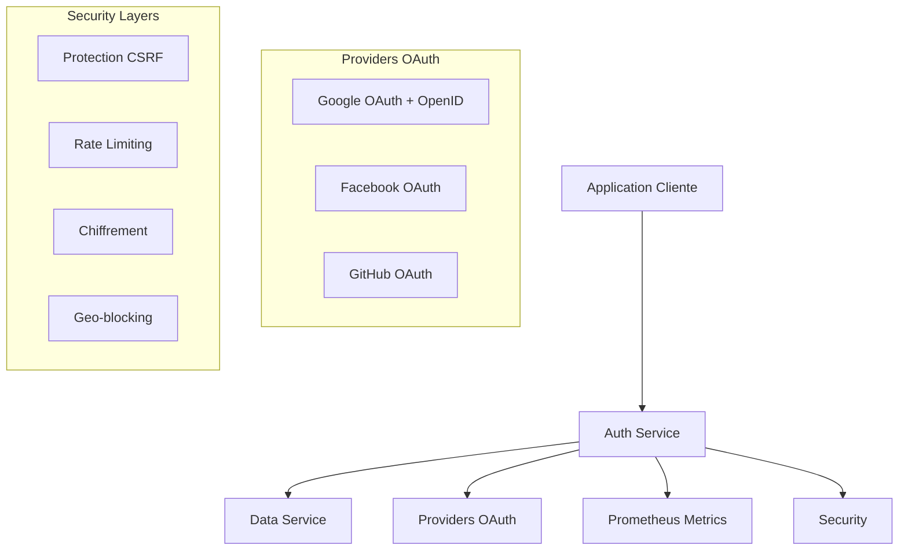

# 🔐 Auth Service - Microservice d'Authentification

## 📋 Description

Microservice d'authentification moderne gérant les opérations OAuth 2.0 et OpenID Connect avec trois fournisseurs d'identité. Ce service respecte l'architecture microservices en communiquant avec un service dédié aux opérations en base de données.

## ✨ Fonctionnalités Clés

### 🔑 Authentification OAuth 2.0 & OpenID Connect
- **Google OAuth** avec OpenID Connect
- **Facebook OAuth** 
- **GitHub OAuth**
- Validation des tokens ID OpenID
- Protection CSRF avec state parameter

### 🛡️ Sécurité Avancée
- **JWT sécurisés** (Access + Refresh tokens)
- **Rate limiting intelligent** par utilisateur
- **Chiffrement des communications**
- **Détection d'activités suspectes**
- **Headers de sécurité** (Helmet, CSP, CORS)
- **Protection contre les attaques CSRF**
- **Geo-blocking optionnel**

### 🏗️ Architecture Microservices
- **Communication avec data-service** pour toutes les opérations BDD
- **Fallback MongoDB** en cas d'indisponibilité
- **Health checks** complets
- **Métriques Prometheus**
- **Logging structuré** avec Winston

## 🔧 Prérequis

- **Node.js** (v16+)
- **Service data-service** en fonctionnement
- **MongoDB** (fallback optionnel)
- **Comptes développeur** pour les providers OAuth

## 🚀 Installation

### 1. Cloner et installer
```bash
git clone <url-du-repository>
cd auth-service
npm install
```

### 2. Configuration des variables d'environnement
```bash
cp .env.example .env
# Éditer .env avec vos configurations
```

### 3. Configuration OAuth

#### Google (OpenID Connect)
1. Aller sur [Google Cloud Console](https://console.cloud.google.com/)
2. Créer un projet et activer l'API Google+ 
3. Configurer l'écran de consentement OAuth
4. Créer des identifiants OAuth 2.0
5. Ajouter l'URL de callback: `http://localhost:5001/auth/oauth/google/callback`

#### Facebook
1. Aller sur [Facebook Developers](https://developers.facebook.com/)
2. Créer une application
3. Configurer Facebook Login
4. Ajouter l'URL de callback: `http://localhost:5001/auth/oauth/facebook/callback`

#### GitHub
1. Aller dans Settings → Developer settings → OAuth Apps
2. Créer une nouvelle OAuth App
3. Ajouter l'URL de callback: `http://localhost:5001/auth/oauth/github/callback`

## 🏃‍♂️ Démarrage

### Développement
```bash
npm run dev
```

### Production
```bash
npm start
```

### Docker
```bash
npm run docker:build
npm run docker:run
```

## 📊 Variables d'Environnement

| Variable | Description | Requis | Exemple |
|----------|-------------|---------|---------|
| `DATA_SERVICE_URL` | URL du service de données | ✅ | `http://localhost:5002/api` |
| `JWT_SECRET` | Clé secrète JWT | ✅ | `supersecretkey123` |
| `GOOGLE_CLIENT_ID` | ID client OAuth Google | ✅ | `xxx.apps.googleusercontent.com` |
| `FACEBOOK_CLIENT_ID` | ID client OAuth Facebook | ✅ | `123456789` |
| `GITHUB_CLIENT_ID` | ID client OAuth GitHub | ✅ | `abcdef123456` |
| `SESSION_SECRET` | Clé secrète session | ✅ | `session-secret-key` |
| `ENCRYPTION_KEY` | Clé de chiffrement | ✅ | `encryption-key-32-chars` |
| `CORS_ORIGIN` | Origines CORS autorisées | ⚠️ | `http://localhost:3000` |
| `ENABLE_GEO_BLOCKING` | Activation geo-blocking | ❌ | `false` |

## 🏗️ Architecture



### 📁 Structure du Projet

```
auth-service/
├── config/
│   ├── jwtConfig.js          # Configuration JWT
│   └── passportConfig.js     # Stratégies OAuth + OpenID
├── controllers/
│   └── authController.js     # Logique d'authentification
├── middleware/
│   └── security.js           # Middlewares de sécurité
├── models/
│   └── User.js              # Modèle utilisateur (fallback)
├── routes/
│   ├── authRoutes.js        # Routes OAuth sécurisées
│   └── metricsRoutes.js     # Métriques Prometheus
├── services/
│   ├── dataService.js       # Client pour data-service
│   └── metricsServices.js   # Services de métriques
├── utils/
│   └── logger.js            # Logging structuré
├── index.js                 # Point d'entrée principal
├── Dockerfile               # Configuration Docker
└── .env.example            # Variables d'environnement
```

## 🔐 Sécurité Implémentée

### ✅ OAuth 2.0 & OpenID Connect
- **Flux d'autorisation** complets pour 3 providers
- **Validation des tokens ID** OpenID Connect
- **State parameter** pour protection CSRF
- **Nonce parameter** pour replay attacks
- **Scope management** approprié

### 🛡️ Protection Avancée
- **Rate limiting adaptatif** (50-200 req/15min selon utilisateur)
- **CSRF protection** avec tokens uniques
- **XSS protection** avec CSP headers
- **Détection d'attaques** par patterns
- **Chiffrement des tokens** en transit
- **Headers de sécurité** complets

### 🌍 Contrôles d'Accès
- **HTTPS obligatoire** en production
- **Geo-blocking configurable**
- **Session sécurisée** avec cookies HttpOnly
- **Validation des certificats**

## 🛣️ Routes API

### 🔑 Authentification OAuth

| Route | Méthode | Description |
|-------|---------|-------------|
| `/auth/oauth/providers` | GET | Liste des providers disponibles |
| `/auth/oauth/google` | GET | Initiation OAuth Google |
| `/auth/oauth/google/callback` | GET | Callback OAuth Google |
| `/auth/oauth/facebook` | GET | Initiation OAuth Facebook |
| `/auth/oauth/facebook/callback` | GET | Callback OAuth Facebook |
| `/auth/oauth/github` | GET | Initiation OAuth GitHub |
| `/auth/oauth/github/callback` | GET | Callback OAuth GitHub |
| `/auth/oauth/logout` | POST | Déconnexion OAuth |
| `/auth/oauth/validate/:token` | GET | Validation de token |

### 🏥 Monitoring

| Route | Méthode | Description |
|-------|---------|-------------|
| `/health` | GET | Health check complet |
| `/ping` | GET | Test de connectivité |
| `/metrics` | GET | Métriques Prometheus |

## 📈 Exemples d'Utilisation

### 1. Authentification Google (Frontend)
```javascript
// Redirection vers Google OAuth
window.location.href = 'http://localhost:5001/auth/oauth/google';

// Gestion du callback
const urlParams = new URLSearchParams(window.location.search);
const token = urlParams.get('token');
if (token) {
  localStorage.setItem('accessToken', token);
}
```

### 2. Validation de Token (Backend)
```javascript
const response = await fetch('http://localhost:5001/auth/oauth/validate/YOUR_TOKEN');
const result = await response.json();

if (result.valid) {
  console.log('Utilisateur:', result.user);
} else {
  console.error('Token invalide:', result.error);
}
```

### 3. Utilisation avec le Data Service
```javascript
// Le auth-service communique automatiquement avec le data-service
// Aucune modification nécessaire côté client
```

## 🧪 Tests

### Tests unitaires
```bash
npm test
```

### Tests d'intégration
```bash
npm run test:integration
```

### Tests de sécurité
```bash
npm run security:audit
```

### Health check
```bash
npm run health:check
```

## 🐳 Déploiement Docker

### Build
```bash
docker build -t auth-service .
```

### Run avec variables d'environnement
```bash
docker run -p 5001:5001 \
  -e DATA_SERVICE_URL=http://data-service:5002/api \
  -e JWT_SECRET=your-secret \
  -e GOOGLE_CLIENT_ID=your-google-id \
  --env-file .env \
  auth-service
```

### Docker Compose (recommandé)
```yaml
version: '3.8'
services:
  auth-service:
    build: .
    ports:
      - "5001:5001"
    environment:
      - DATA_SERVICE_URL=http://data-service:5002/api
    depends_on:
      - data-service
    volumes:
      - ./logs:/app/logs
```

## 📊 Métriques et Monitoring

### Métriques disponibles
- **http_requests_total** : Nombre total de requêtes
- **http_request_duration_seconds** : Durée des requêtes
- **user_registrations_total** : Inscriptions utilisateur
- **oauth_attempts_total** : Tentatives OAuth

### Health Checks
```bash
curl http://localhost:5001/health
```

Retourne :
```json
{
  "status": "healthy",
  "timestamp": "2025-01-15T10:30:00.000Z",
  "services": {
    "dataService": "healthy",
    "mongodb": "healthy"
  }
}
```

## 🔧 Configuration Avancée

### Rate Limiting
```javascript
// Limites par type d'utilisateur
Admin: 200 req/15min
Utilisateur connecté: 100 req/15min
Anonyme: 50 req/15min
OAuth: 10 req/5min
```

### Geo-blocking
```bash
# Dans .env
ENABLE_GEO_BLOCKING=true
BLOCKED_COUNTRIES=CN,RU,KP
```

### Monitoring continu
```bash
# Dans .env
ENABLE_HEALTH_MONITORING=true
```

## 🚨 Sécurité en Production

### ✅ Checklist de déploiement
- [ ] Changer tous les secrets (`JWT_SECRET`, `SESSION_SECRET`, etc.)
- [ ] Configurer HTTPS obligatoire
- [ ] Mettre à jour les URLs de callback en HTTPS
- [ ] Activer le geo-blocking si nécessaire
- [ ] Configurer les CORS appropriés
- [ ] Activer le monitoring
- [ ] Tester tous les flows OAuth
- [ ] Vérifier les logs de sécurité

### 🔐 Rotation des clés
```bash
# Génération de nouvelles clés
node -e "console.log(require('crypto').randomBytes(32).toString('hex'))"
```

## 🤝 Intégration avec d'autres services

### Data Service (requis)
```javascript
// Le auth-service communique via REST API
POST /users          # Création utilisateur
GET /users/:id       # Récupération utilisateur
PUT /users/:id       # Mise à jour utilisateur
GET /users/email/:email  # Recherche par email
```

### API Gateway
```yaml
# Configuration API Gateway
paths:
  /auth/*:
    target: http://auth-service:5001
    methods: [GET, POST]
    auth: false
```

## 📝 Logging

### Structure des logs
```json
{
  "level": "info",
  "message": "Auth event: oauth_login",
  "auth_event": "oauth_login",
  "provider": "google",
  "userId": "507f1f77bcf86cd799439011",
  "timestamp": "2025-01-15T10:30:00.000Z",
  "service": "auth-service"
}
```

### Fichiers de logs
```
logs/
├── combined.log      # Tous les logs
├── error.log         # Erreurs uniquement
└── exceptions.log    # Exceptions non gérées
```

## 🔍 Dépannage

### Problèmes courants

#### Data-service indisponible
```
✅ Solution: Le service fonctionne en mode dégradé avec MongoDB
⚠️ Vérifier: DATA_SERVICE_URL dans .env
```

#### Erreur OAuth "invalid_client"
```
✅ Solution: Vérifier CLIENT_ID et CLIENT_SECRET
⚠️ Vérifier: URLs de callback dans les consoles OAuth
```

#### Rate limiting trop strict
```
✅ Solution: Ajuster les limites dans SecurityMiddleware
⚠️ Vérifier: Logs pour identifier les patterns d'usage
```

## 📚 Ressources

- [OAuth 2.0 RFC](https://tools.ietf.org/html/rfc6749)
- [OpenID Connect Spec](https://openid.net/connect/)
- [Google OAuth Setup](https://developers.google.com/identity/protocols/oauth2)
- [Facebook OAuth Setup](https://developers.facebook.com/docs/facebook-login)
- [GitHub OAuth Setup](https://docs.github.com/en/developers/apps/building-oauth-apps)

## 🤝 Contribuer

1. Fork du projet
2. Créer une branche de fonctionnalité (`git checkout -b feature/amazing-feature`)
3. Commiter vos modifications (`git commit -m 'Add amazing feature'`)
4. Push vers la branche (`git push origin feature/amazing-feature`)
5. Ouvrir une Pull Request

## 📄 Licence

MIT License - voir le fichier [LICENSE](LICENSE) pour plus de détails.

---

**⚡ Service d'authentification moderne avec OAuth 2.0, OpenID Connect et sécurité avancée**